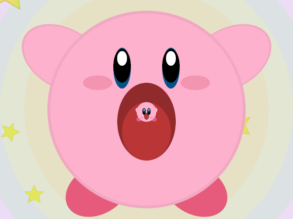
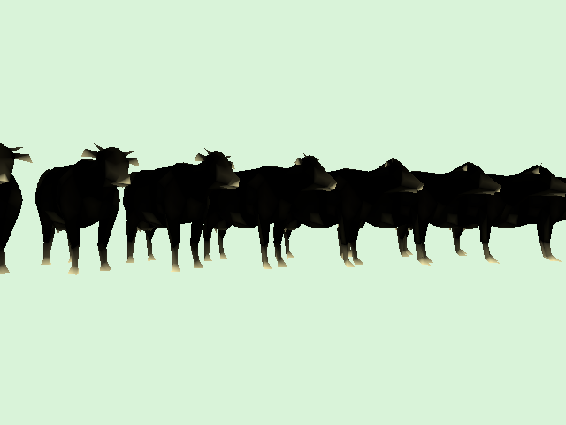

# balboa
UCSD CSE 167 codebase
https://cseweb.ucsd.edu/~tzli/cse167/

# HW Showcase: 


<video controls src="outputs/hw3/hw_3_5.mp4" title="Title"></video>


https://github.com/user-attachments/assets/7770f83b-e675-47f9-87ba-d896a2341722


https://github.com/user-attachments/assets/350d0462-7e8d-466f-9ba2-b04cacf624d2


# Build
All the dependencies are included. Use CMake to build.
```shell
git clone --recurse-submodules https://github.com/BachiLi/balboa_public mkdir build
cd build
cmake ..
make -j
```
It requires compilers that support C++17 (gcc version >= 8, clang version >= 7, Apple Clang version >= 11.0, MSVC version >= 19.14).

---
### For Windows users:
1. Install [Visual Studio 2022](https://visualstudio.microsoft.com/downloads/) and [Visual Studio Code](https://code.visualstudio.com/). Choose "Desktop development with C++" and check "C++ CMake tools for Windows" on the recipe. 
2. `git clone --recurse-submodules https://github.com/BachiLi/balboa_public`
3. `cd balboa_public; mkdir build; cd build`
4. `cmake ..`
5. At this point, you can either open up the `balboa.sln` in `build` folder and use Visual Studio as your IDE, or work with Visual Studio Code. 

(optional) To build, run, and debug in VS Code: 

1. In the bottom bar, configure CMake as follows (from left to right): 
    - Build variant: `RelWithDebInfo`. 
    - Active kit: `Visual Studio ... x64`, choose the appropriate one depending on your architecture. 
    - Default build target: `balboa`. 
2. Create a `launch.json` in `.vscode` folder: 
    ```json
    {
        "version": "0.2.0",
        "configurations": [
            {
                "name": "hw1_1", 
                "type": "cppvsdbg", 
                "request": "launch", 
                "program": "${workspaceFolder}/build/${command:cmake.buildType}/balboa.exe",
                "cwd": "${workspaceFolder}/build/${command:cmake.buildType}", 
                "args": ["-hw", "1_1"]
            }
        ]
    }
    ```
    You can pass arguments using `args`. 
3. Press `Ctrl+Shift+D` to start the debugger. You can set breakpoints, inspect variables, and trace callstack, etc. 

---
### For Linux users (or Windows users using WSL):
You may need the following packages
```shell
sudo apt install g++ cmake libx11-dev libxrandr-dev libxinerama-dev libxcursor-dev libxi-dev libgl-dev
```

# Run
Try 
```shell
cd build
./balboa -hw 1_1
```
This will generate an image "hw1_1.png".

# Acknowledgement
stb\_image, stb\_image\_write, json, tinyply, GLFW, and glad

We use [stb_image](https://github.com/nothings/stb) and [stb_image_write](https://github.com/nothings/stb) for reading & writing images.

We use [json](https://github.com/nlohmann/json) to parse JSON files.

We use [tinyply](https://github.com/ddiakopoulos/tinyply) for parsing PLY files.

We use [glfw](https://www.glfw.org/) and [glad](https://glad.dav1d.de/) for the OpenGL homeworks.

3D models and textures: [Stanford 3D Scanning Repository](https://graphics.stanford.edu/data/3Dscanrep/), [KickAir_8p](https://blenderartists.org/t/uv-unwrapped-stanford-bunny-happy-spring-equinox/1101297), and [Texturemontage](http://kunzhou.net/tex-models.htm).
